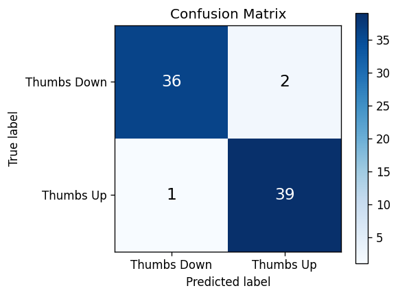
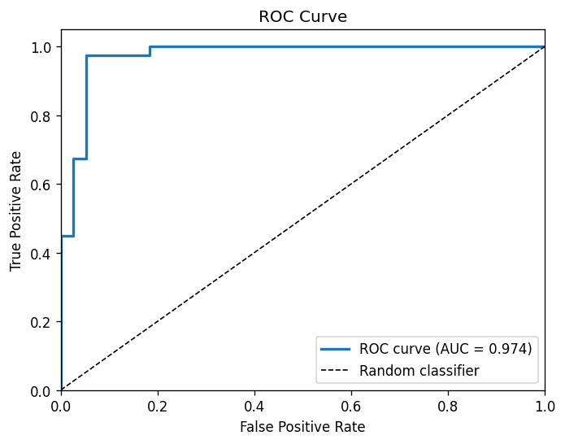
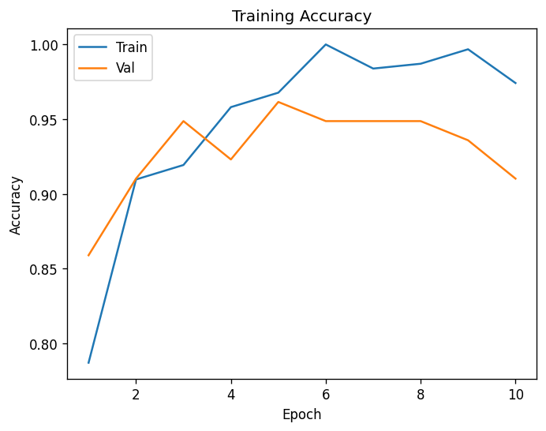

# Hand Gesture Volume Control

A real-time Windows volume controller driven by hand gestures. A MobileNetV2 model fine-tuned on 97 labelled webcam images watches a live webcam feed, classifies each frame as thumbs-up, thumbs-down, or uncertain, and adjusts system volume through the Windows audio API whenever a high-confidence gesture is detected. A confidence threshold of 0.75 and an 0.8-second cooldown prevent false triggers, and the OpenCV display window shows a green/red border, confidence score, and a live volume bar so the system state is always visible.

---

## Results

Model trained on 97 images (50 thumbs-up, 47 thumbs-down), evaluated on a held-out validation set of 20 images (80/20 stratified split). EarlyStopping halted training at epoch 7; best checkpoint was restored from epoch 2.

| Metric | Value |
| --- | --- |
| Accuracy | **0.90** |
| Precision | **0.90** |
| Recall | **0.90** |
| F1-score | **0.90** |
| ROC AUC | **0.96** |

> **Important context:** the validation set contains only 20 samples. These metrics reflect strong performance on this specific split but should not be extrapolated to production use. A dataset of several hundred images per class with diverse lighting conditions and hand shapes would be needed to claim production-level reliability. See `outputs/metrics.json` for the machine-readable version of these figures.

### Confusion Matrix



### ROC Curve (AUC = 0.96)



### Training Accuracy



---

## System Architecture

```text
Webcam frame (BGR)
    |
    v
cv2.cvtColor(BGR -> RGB)         # match MobileNetV2 ImageNet training colour space
    |
    v
cv2.resize(224 x 224)
    |
    v
mobilenet_v2.preprocess_input()  # scale [0, 255] to [-1, 1]
    |
    v
MobileNetV2 (ImageNet weights)   # feature extractor, last 30 layers unfrozen
    |
    v
GlobalAveragePooling2D
Dense(128, relu) -> Dropout(0.3)
Dense(1, sigmoid)                # output: probability of thumbs-up
    |
    +-- output > 0.75  ->  Thumbs Up   ->  pycaw: volume + 10%
    +-- output < 0.25  ->  Thumbs Down ->  pycaw: volume - 10%
    +-- 0.25 to 0.75   ->  Unknown     ->  no action
```

The confidence threshold (0.75) and cooldown (0.8 s) are constants at the top of `src/inference.py` and can be adjusted without retraining the model.

---

## Project Structure

```text
app.py                          # Flask web app for uploading and labelling training images
src/
    train.py                    # MobileNetV2 fine-tuning, evaluation, TFLite export
    inference.py                # Real-time webcam inference + Windows volume control
    preprocess.py               # Scan image folders, generate labelled CSV
    download_data.py            # Download training images from Bing
data/
    images/
        thumbs_up/              # Thumbs-up training images
        thumbs_down/            # Thumbs-down training images
    labels.csv                  # Generated image labels (gitignored)
outputs/
    models/
        model.h5                # Trained Keras model (ready to use)
        model.tflite            # TFLite export for edge deployment
    plots/
        confusion_matrix.png
        roc_curve.png
        training_accuracy.png
        training_loss.png
    metrics.json
    training_history.json
templates/                      # HTML templates for the Flask data collection app
requirements.txt
```

---

## Requirements

- **OS:** Windows (volume control via pycaw is Windows-only; training and data collection work on any OS)
- **Python:** 3.8 exactly. TensorFlow 2.13 does not support Python 3.9+ on the Windows binary, and Python 3.10+ breaks several dependencies.

Check your available Python versions with `py -0` (Windows Launcher).

---

## Installation

```bash
git clone https://github.com/achalnm/HandGesture-VolumeControl.git
cd HandGesture-VolumeControl

# Create a venv with Python 3.8 specifically
py -3.8 -m venv venv
venv\Scripts\activate

pip install -r requirements.txt
```

The trained model is already committed to the repo (`outputs/models/model.h5`), so you can skip straight to inference if you do not want to retrain.

---

## Usage

### 1. Collect your own training data

Run the Flask data collection app:

```bash
python app.py
```

Open `http://localhost:5000` in your browser. Select your thumbs-up image folder and thumbs-down image folder using the upload form. After uploading, click **Generate & Download CSV**. The file is saved to `data/` and downloaded automatically.

Alternatively, if images are already in `folder1/` (thumbs-up) and `folder2/` (thumbs-down), generate the CSV directly:

```bash
python src/preprocess.py --output data/labels.csv
```

### 2. Train the model

```bash
python src/train.py --csv data/labels.csv --output outputs/model.h5
```

Training runs for up to 50 epochs with EarlyStopping (patience 5). With 97 images on CPU it completes in under two minutes. After training, the following files are written automatically:

- `outputs/models/model.h5`: best checkpoint (Keras HDF5)
- `outputs/models/model.tflite`: TFLite export
- `outputs/training_history.json`: per-epoch loss and accuracy
- `outputs/training_accuracy.png` and `outputs/training_loss.png`: training curves
- `outputs/confusion_matrix.png`, `outputs/roc_curve.png`: evaluation plots
- `outputs/metrics.json`: accuracy, precision, recall, F1, AUC

### 3. Run real-time inference

```bash
python src/inference.py --model outputs/models/model.h5
```

The OpenCV window shows:

- **Green border**: a gesture has been detected above the confidence threshold
- **Red border**: no confident gesture detected (uncertain or no hand visible)
- **Amber "cooldown..." badge**: a gesture was detected but the 0.8 s cooldown has not elapsed yet
- **Volume bar** (right side): current system master volume as a filled bar
- **Confidence percentage**: the model's raw output confidence for the detected class

Press **Q** to quit.

---

## Configuration

All tunable constants are defined at the top of the relevant source file. No retraining is needed to change inference behaviour.

| Constant | File | Default | Description |
| --- | --- | --- | --- |
| `CONFIDENCE_THRESHOLD` | `src/inference.py` | `0.75` | Minimum sigmoid output to act on a gesture |
| `COOLDOWN_SECONDS` | `src/inference.py` | `0.8` | Minimum gap in seconds between volume changes |
| `VOLUME_STEP` | `src/inference.py` | `0.1` | Volume fraction changed per gesture (10%) |
| `IMG_SIZE` | all `src/` files | `224` | Frame resize dimension fed to the model |
| `EPOCHS` | `src/train.py` | `50` | Maximum training epochs (EarlyStopping usually fires earlier) |
| `LEARNING_RATE` | `src/train.py` | `1e-4` | Adam learning rate for fine-tuning |
| `UNFREEZE_LAST_N` | `src/train.py` | `30` | Number of MobileNetV2 layers unfrozen for fine-tuning |
| `PATIENCE` | `src/train.py` | `5` | EarlyStopping patience in epochs |

---

## Tech Stack

| Component | Library / Version |
| --- | --- |
| Language | Python 3.8 |
| Deep learning | TensorFlow 2.13 / Keras 2.13 |
| Base model | MobileNetV2 (ImageNet pretrained) |
| Computer vision | OpenCV 4.8 |
| Windows audio | pycaw + comtypes |
| Data handling | pandas, NumPy, scikit-learn |
| Data collection UI | Flask 3.0 |
| Evaluation plots | matplotlib |

---

## Notes

**Why MobileNetV2?** Transfer learning from a model pretrained on 1.2 million ImageNet images lets the network extract meaningful visual features even from a 97-image dataset. A CNN trained from scratch on this little data overfits immediately.

**Why only 97 images?** This project demonstrates the full ML pipeline: data collection, preprocessing, transfer learning, evaluation, and real-time inference in a single clean codebase. The architecture scales: collecting 300-500 images per class with varied lighting and hand positions would substantially improve real-world robustness.

**Why Python 3.8?** TensorFlow 2.13 is the last release with full Windows binary support on Python 3.8. Newer Python versions require TF 2.14+ which ships a different Keras API. Pinning to 3.8 + TF 2.13 keeps the stack stable.

**Windows only (for inference).** The `pycaw` library wraps the Windows Core Audio API and is not available on macOS or Linux. The training pipeline (`src/train.py`, `src/preprocess.py`, `app.py`) runs on any OS.
